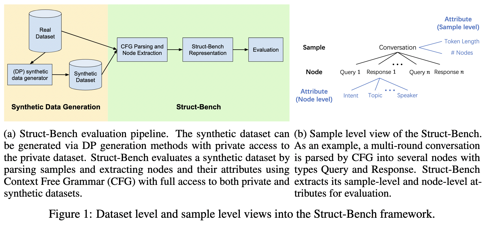

<h1 align="center"> Struct-Bench: A Benchmark for Differentially Private Structured Text Generation</h1>

<p align="center">
<a href="https://struct-bench.github.io"> Leaderboard</a>
</p>

This repository implements Struct-Bench, a novel evaluation framework and a benchmark to evaluate synthetic data quality relative to a real dataset, where the real dataset features complex inter-field structural relations, and at least some fields contain natural language. We illustrate the dataset level and sample level views into Struct-Bench as follows:

<p align="center">
  
</p>

---
## Table of Contents
1. [Project Setup](#project-setup)
2. [Forking & Pull Requests](#forking--pull-requests)
3. [Adding and Evaluating Datasets](#adding-and-evaluating-datasets)
4. [Generating Synthetic Datasets](#generating-synthetic-datasets)
5. [Key Files & Directories](#key-files--directories)
6. [Acknowledgement](#acknowledgement)

---
## Project Setup
1. **Clone the Repo**
```bash
git clone hhttps://github.com/struct-bench/structpe.git
cd structpe
```

2. **Install**
- **Recommended**: Create a fresh virtual environment (`conda` or `venv`).
- Then install locally:
```bash
pip install .
```
- Or for editable mode (if you intend to develop and push changes):
```bash
pip install -e .
```

---
## Forking & Pull Requests
Adding new datasets to **Struct-Bench** are welcome! To propose a change or new feature, follow these steps:
1. **Fork the Repo on GitHub**
   - Visit the [structpe GitHub page](https://github.com/yourusername/structpe), click “Fork”, and choose your GitHub account.

2. **Clone Your Fork**
```bash
git clone https://github.com/yourfork/structpe.git
cd structpe
```

3. **Create a Branch**
```bash
git checkout -b my-new-dataset
```

4. **Make Your Changes**
- Add new files, fix bugs, or implement new features.
- Update or add unit tests in `tests/`.

5. **Push & Open a Pull Request**
```bash
git commit -am "Add new dataset for XYZ"
git push origin my-new-dataset
```
- Then open a Pull Request on GitHub from your fork.

6. **Review & Merge**
- The maintainers will review your PR, offer feedback, and merge once approved.

---
## Adding and Evaluating Datasets
Struct-Bench uses a **registry** pattern to easily integrate more datasets. Here’s how:
1. **Create a New File**
   - In `structpe/dataset/`, for example: `my_new_dataset.py`.
   - Define your sample class (`MyNewSample`) and a container class (`MyNewDataset`).
   - Use existing atomic types from `_types.py` or define constraints as needed.

2. **Define the context-free grammar of the data structure**

3. **Register the Dataset**
   - At the end of that file:
```python
from structpe.dataset.registry import register_dataset
register_dataset("my_new_dataset", MyNewDataset)
```
4. (Optional) Provide any `dataset_metric(level=...)` functions to compute custom metrics.
5. (Optional) If lines in grammar have fields that are logically comparable, define `compute_node_similarities = [("fieldA", "fieldB"), ...]`.

Then run:

```bash
structpe evaluate \
        --private-dataset-name=my_dataset \
        --private-dataset-json=data/my_dataset.json \
        --synthetic-data=data/synthetic_dataset.json \
        --savedir results_my_dataset
```

You’ll get a comprehensive JSON summarizing correctness, adjacency, grammar, KNN-based metrics, plus your custom dataset metrics.

Please refer to <a href="structpe/dataset">this link</a> for more details on the dataset evaluation framework.


---
## Generating Synthetic Datasets

We adopt the DP Fine-tuning [(Yu et al. 2021)](https://arxiv.org/pdf/2110.06500) and Augmented Private Evolution (Aug-PE) algorithm [(Xie et al. 2024)](https://arxiv.org/abs/2403.01749) to generate synthetic datasets on graph-structured data ([ShareGPT](https://huggingface.co/datasets/anon8231489123/ShareGPT_Vicuna_unfiltered/tree/bcd32a724d8460ebe14e1d05b0195e30e9a46cb1), [ICLR reviews](https://openreview.net/group?id=ICLR.cc/2024/Conference)), tabular data ([Water](https://www.kaggle.com/datasets/tharunmss/water-bottle-dataset-flipkart), [Arena](https://arxiv.org/pdf/2306.05685), [Adult](https://archive.ics.uci.edu/dataset/2/adult)), and attribute controllable data ([Reviews](https://www.kaggle.com/datasets/structpedataset/structpe-synthetic-datasets), [Grounding](https://www.kaggle.com/datasets/structpedataset/structpe-synthetic-datasets)). We adopt the external library [microsoft/dp-transformers](https://github.com/microsoft/dp-transformers/tree/main/research/synthetic-text-generation-with-DP) for DP Fine-tuning, and [microsoft/DPSDA](https://github.com/microsoft/DPSDA) for Aug-PE.

We also implement the Aug-PE algorithm in <a href="structpe/generator">structpe/generator</a> to generate synthetic attribute controllable data. 

Generate DP synthetic text with Aug-PE:

```python
from structpe.generator.generation import run_generation_pipeline

synthetic_texts = run_generation_pipeline(
        file_path="data/input.tsv",
        file_type="tsv",   # or "csv" or "json"
        dataset_name="my_dataset",
        concurrency=4,
        init_count=10,
        iterations=3,
        endpoint="https://myazureendpoint.openai.azure.com/",   # replace to your OpenAI endpoint
        deployment="gpt-4"
)
```

### Some key parameters:
- **`file_path`**: Path to your input file (`JSON`, `CSV`, or `TSV`).
- **`file_type`**: Must be `"json"`, `"csv"`, or `"tsv"`.
- **`concurrency`**: Number of threads to use for Azure OpenAI calls.
- **`init_count`**: Initial sample count.
- **`iterations`**: How many iteration cycles.
- **`endpoint`**: Your Azure OpenAI endpoint.
- **`deployment`**: Name of the model deployment (e.g., `"gpt-4"`).

### Return Value:
A list of final generated strings.

Please refer to <a href="structpe/generator">this link</a> for more details on the synthetic data generation.


---
## Key Files & Directories
- **`structpe/_types.py`**  
  Holds enumerations and atomic range classes (e.g. `AtomicRangeInt`) used by multiple datasets.

- **`structpe/dataset/`**  
  Holds each dataset definition (`search_dataset.py`, `hotel_booking_dataset.py`, etc.) plus `registry.py` for dynamic dataset lookup.

- **`structpe/descriptor/descriptor.py`**  
  Implements reflection-based serialization so that entire dataset objects can be stored as JSON and reconstructed.

- **`structpe/evaluator/`**  
  Contains the `Evaluator` class (with JSON output) and supporting classes (`LLMJudge`, `Verifier`, etc.) for constraint checks, distribution stats, and more.

- **`structpe/generator/generation.py`**  
  Demonstrates how to create synthetic samples from existing dataset descriptions (currently for `search_query`).

- **`structpe/run.py`**  
  Houses the CLI. Subcommands:
    - `list datasets`: Show registered datasets
    - `run --dataset-name=XYZ`: Instantiate and evaluate a dataset

- **`tests/`**  
  Contains unit tests such as:
    - `test_dataset.py` (checks correctness of dataset classes),
    - `test_pipeline.py` (verifies pipeline logic),
    - `test_evaluator.py` (tests evaluation output).

---
## Acknowledgement

- [microsoft/DPSDA](https://github.com/microsoft/DPSDA)
- [microsoft/dp-transformers](https://github.com/microsoft/dp-transformers/tree/main/research/synthetic-text-generation-with-DP)

---

**Disclaimer: Please expect changes in the framework as we improve it further based on feedback from researchers and practitioners.**
